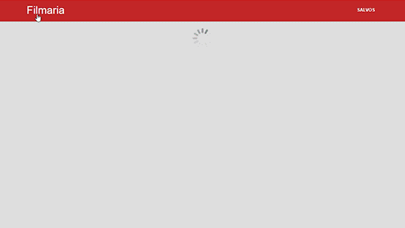

<div align="center">


</div>

# filmaria
Projeto prático do curso de vue do Sujeito Programador. Contém rotas, componentização e requisições HTTP.
## Get started
```
# Instale todas as dependências:
$ npm install

# Para desenvolvimento:
$ npm run serve

# Para produção:
$ npm run build
```
## Tecnologias
* html
* css
* javascript
* vue
* vue-router
* axios